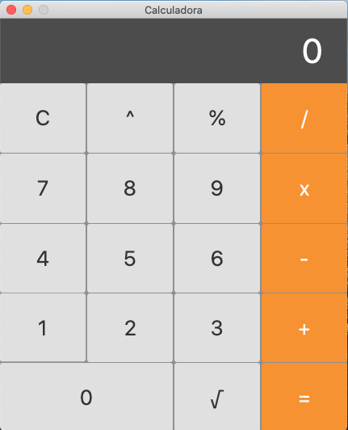

# Calculadora distribuida
Projeto desenvolvido para a matéria de sistemas distribuidos do curso de ciência da computação da FACAPE. 
Matéria ministrada pelo professor Thomas Rabelo.

## Ferramentas utilizadas
- Java
- Intellij IDEA
- Socket
- JavaFX

## Exemplo

